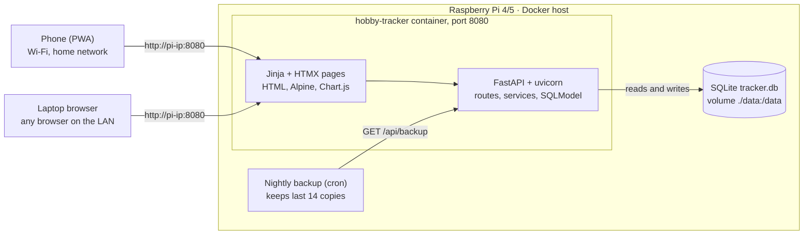
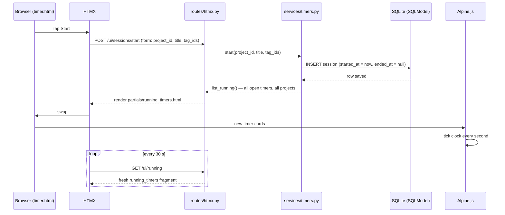

# Hobby Time Tracker — Design Doc

Oct 1, 2026

## Overview

A self-hosted web app that tracks time spent on hobbies and learning, runs in one Docker container on a Raspberry Pi, and is opened from any device on the home network at `http://<pi-ip>:8080`. It copies the Japanese-learning tracker in the reference screenshots (timer, tagged sessions, statistics) and makes it work for any activity: Chinese and Japanese study, painting, coding for work.

**Goals**

- Log time in two taps: pick a project, tap a tag, press Start.
- Run several timers at once (podcast while doing chores, Anki while listening).
- Show an honest total of hours invested, per project and per tag, so effort is not overestimated.
- Show consistency over time: last 30 days bars, streak, day record.
- Keep all data on the Pi in one SQLite file that is easy to back up.

**Non-goals for v1**

- No accounts, cloud sync or internet access; one user on a trusted home network.
- No native mobile app; the web UI is responsive and installable as a PWA.
- No social features or leaderboards.

**From the reference app to this one**

| Reference app | This app |
| --- | --- |
| One focus: learning Japanese | Many projects: Chinese, Japanese, Painting, Coding |
| Tags: Listening, Watching, YouTube, Reading, Mining, Anki | Tags per project, with starter sets per project type |
| Hosted on the creator's site | Runs on your Raspberry Pi, LAN only |
| Users send feature requests to the creator | A built-in Ideas list where you note features to build next |

## Core concepts and data model

Everything hangs off a **session**: one block of time with a start, an end, a title and tags, inside one project. A session with no end is a running timer, so any number can run at once and timers survive closing the browser.

| Entity | Fields | Notes |
| --- | --- | --- |
| Project | id, name, color, type (language, art, coding, other), daily_goal_min, archived, created_at | "Learning Chinese", "Painting", "Work coding" |
| Tag | id, project_id, name, color, sort_order | Belongs to one project; Listening, Reading, Anki, Mining, Sketching |
| Session | id, project_id, title, started_at, ended_at (null = running), paused_at (null = not paused), paused_sec, note, created_via (timer or manual) | Times stored in UTC |
| SessionTag | session_id, tag_id | A session can carry several tags (Watching + YouTube) |
| Idea | id, text, status (open, planned, done), created_at | The built-in feature-request list |
| Setting | key, value | timezone (default Asia/Tokyo), day_start_hour, week_start |

**Rules**

- Duration = (ended_at or now) − started_at − paused_sec − (now − paused_at if paused).
- Pause sets paused_at; resume adds the gap to paused_sec and clears paused_at. The list shows "Paused time: 2 min 23 sec" like the reference.
- A session counts toward the day it **started** in the user's timezone (23:59–00:15 counts for the earlier day, as in the screenshot).
- Time per tag adds the full duration to each tag on the session, so tag totals can sum to more than the project total. The stats page says so under the chart.
- Projects are archived, never hard-deleted, so old hours stay in the totals.

**Starter tag sets** (created with a new project, editable after)

| Project type | Tags |
| --- | --- |
| Language | Listening, Watching, YouTube, Reading, Manga, Audiobook, Anki, Mining, Speaking, Writing |
| Art | Sketching, Painting, Study, Reference, Practice drills |
| Coding | Work, Side project, Learning, Code review, Debugging |
| Other | none |

## Features and UI

Two main tabs, **Timer** and **Statistics**, under a project picker, matching the reference layout. Dark theme by default, mobile-first, usable one-handed on a phone.

**Timer tab**

1. Project picker at the top (colored dot + name, dropdown), with "+ New project" and an edit pencil.
2. Quick-start bar: a title field, the project's tag chips (tap to toggle, pencil to edit, "+ New tag") and a green Start button. Start with an empty title uses the tag names as the title.
3. Running timers panel: one card per running session with live elapsed time, Pause/Resume and Stop. Several cards can run at once, even across projects.
4. Session list grouped by day, newest first, with the day total on the right. Each row: title, duration ("1 h 46 min"), start–end time, paused time if any, tag pills, and three actions: ▶ restart with same title and tags, ✎ edit, × delete (with undo toast).
5. "Add past session" for time logged without the timer (start, end or duration, tags).

**Statistics tab** (for the selected project, or "All projects")

1. Stat cards: Total time, Sessions, Longest session (with its title), Day record (with its date), Current streak.
2. Last 30 days bar chart, one bar per day, today at the right; a range switch for 7 days, 30 days, 12 months, all time.
3. Time per tag: horizontal bars sorted by time, with hours and minutes at the right.
4. Daily goal line on the bar chart when the project has a goal.
5. Calendar heatmap of the year (like Anki's Review Heatmap) for the consistency view.

**Other pages**

- Projects: create, rename, recolor, archive.
- Ideas: a simple list of feature ideas with open, planned, done status (the feedback loop from the reference app, pointed at yourself).
- Settings: timezone, day start hour, export CSV/JSON, import JSON, download a database backup.

**Friction rules**

- Starting a timer from the open page takes at most 2 taps.
- Running timers show in the browser tab title ("⏱ 2 running · 0:42:10") so they are not forgotten.
- A timer running over 6 hours shows a warning on its card, to catch timers left on overnight.
- Installable as a PWA so it opens like an app from the phone home screen.

## Architecture and tech stack

One Python process (FastAPI) renders the HTML pages and serves the JSON API, so there is one language, no Node or npm build step, one container, one port and one data file to back up. HTMX swaps page fragments without a JavaScript framework; Alpine.js ticks the live timers; Chart.js draws the stats.



Phones and laptops on the home Wi-Fi open the Pi's address; the container keeps all state in SQLite on a mounted volume, and a host cron job copies it nightly.

| Layer | Choice | Why it is quick |
| --- | --- | --- |
| Backend | Python 3.13, FastAPI, uvicorn | Few files, fast on ARM, auto API docs at `/docs` |
| Models and DB access | SQLModel (SQLAlchemy + Pydantic in one class) | One class = table + validation |
| Database | SQLite, WAL mode | No extra service; one file to back up |
| Migrations | Alembic | Schema changes without losing data |
| Pages | Jinja2 templates | Server renders HTML; no frontend framework |
| Interaction | HTMX 2 (vendored file) | Buttons swap HTML fragments; no JS app to write |
| Live timers | Alpine.js 3 | A few lines tick running timers every second |
| Charts | Chart.js 4 | 30-day bars and per-tag bars in about 20 lines |
| Styling | Pico.css (dark theme) + small `app.css` | Clean look with no build step |
| Tests | pytest + FastAPI TestClient | Duration and stats rules are the risky parts |
| Container | One `python:3.13-slim` image, linux/arm64 | Builds on the Pi in about a minute |

JS and CSS libraries are saved into `app/static/vendor/` instead of loaded from a CDN, so the app works even when the internet is down.

## Codebase outline

One Python package, `app/`, split into four layers: **routes** take HTTP requests, **services** hold the rules (durations, stats), **models** define tables, **templates** render HTML. Routes never touch SQL directly; services never return HTML.

```text
hobby-tracker/
├── DESIGN.md                  # this document
├── Dockerfile
├── docker-compose.yml
├── requirements.txt           # fastapi, uvicorn, sqlmodel, alembic, jinja2, python-multipart, pytest, httpx
├── alembic.ini
├── migrations/                # Alembic versions
├── scripts/
│   └── backup.sh              # cron: curl /api/backup, keep last 14
├── data/                      # SQLite volume (git-ignored)
├── app/
│   ├── main.py                # FastAPI app, mounts static, includes routers, runs migrations
│   ├── config.py              # DATABASE_PATH, TZ, day_start_hour from env
│   ├── db.py                  # engine (WAL on), get_session() dependency
│   ├── models.py              # Project, Tag, Session, SessionTag, Idea, Setting
│   ├── schemas.py             # request/response models for the JSON API
│   ├── services/
│   │   ├── timers.py          # start, pause, resume, stop, restart, duration()
│   │   ├── stats.py           # totals, longest, day record, streak, per-day, per-tag
│   │   ├── projects.py        # create with starter tags, archive
│   │   └── backup.py          # export/import JSON + CSV, SQLite backup copy
│   ├── routes/
│   │   ├── pages.py           # GET /, /stats, /projects, /ideas, /settings (full pages)
│   │   ├── htmx.py            # POST /ui/... returns HTML fragments for HTMX swaps
│   │   └── api.py             # /api/... JSON (export, backup, health, future integrations)
│   ├── templates/
│   │   ├── base.html          # layout, nav, project picker, loads vendor JS/CSS
│   │   ├── timer.html         # quick-start bar + running timers + session list
│   │   ├── stats.html         # stat cards + charts
│   │   ├── projects.html, ideas.html, settings.html
│   │   └── partials/
│   │       ├── running_timers.html
│   │       ├── session_list.html
│   │       ├── session_row.html
│   │       └── tag_chips.html
│   └── static/
│       ├── app.css
│       ├── app.js             # Alpine timer ticker, Chart.js setup
│       ├── manifest.webmanifest, sw.js, icons/   # PWA
│       └── vendor/            # htmx.min.js, alpine.min.js, chart.umd.min.js, pico.min.css
└── tests/
    ├── test_timers.py         # pause math, concurrent timers, midnight rule
    ├── test_stats.py          # totals, streak, per-tag
    └── test_routes.py         # pages return 200, HTMX fragments swap
```

**Three kinds of routes**

| Prefix | Returns | Used by |
| --- | --- | --- |
| `/`, `/stats`, `/projects`, `/ideas`, `/settings` | Full HTML page | Browser navigation |
| `/ui/...` | HTML fragment | HTMX buttons and forms (start, stop, pause, edit, delete) |
| `/api/...` | JSON | Export, backup, health check, later AnkiConnect or scripts |

**Connection flow: tapping Start**



Every button works the same way: HTMX sends a small request, a route calls one service function, the service writes to SQLite, and the route sends back only the HTML fragment that changed. The 30-second re-poll keeps a timer started on the phone visible on the laptop. Stats pages load once and pass their numbers to Chart.js as JSON in the template.

## API endpoints

The table lists every action the app supports. In v1 the buttons call the same paths under `/ui/` (in `routes/htmx.py`) and get an HTML fragment back; the `/api/` JSON versions share the same service functions and only export, backup and health are needed from day one. FastAPI's auto docs at `/docs` list the JSON routes.

| Method | Path | Purpose |
| --- | --- | --- |
| GET / POST | /api/projects | List (with ?archived=) / create project with starter tags |
| PATCH / DELETE | /api/projects/{id} | Edit / archive project |
| GET / POST | /api/projects/{id}/tags | List / create tags |
| PATCH / DELETE | /api/tags/{id} | Edit / delete tag (blocked if used; archive instead) |
| GET | /api/sessions | List by ?project_id, ?from, ?to, ?tag_id, paged |
| GET | /api/sessions/running | All running timers, all projects |
| POST | /api/sessions/start | Start timer: project_id, title, tag_ids |
| POST | /api/sessions/{id}/pause | Pause a running timer |
| POST | /api/sessions/{id}/resume | Resume a paused timer |
| POST | /api/sessions/{id}/stop | Stop a timer, sets ended_at |
| POST | /api/sessions/{id}/restart | New running session copying title and tags |
| POST | /api/sessions | Add past session manually |
| PATCH / DELETE | /api/sessions/{id} | Edit / delete session |
| GET | /api/stats | ?project_id, ?range: totals, longest, day record, streak, per-day series, per-tag totals |
| GET / POST / PATCH | /api/ideas | Feature idea list |
| GET / PUT | /api/settings | Timezone, day start, week start |
| GET | /api/export?format=csv\|json | Full export |
| POST | /api/import | Restore from JSON export |
| GET | /api/backup | Download a consistent copy of the SQLite file |
| GET | /api/health | For the Docker healthcheck |

The server computes durations and stats so phone and laptop always show the same numbers. The running-timers panel carries `hx-get="/ui/running" hx-trigger="every 30s"`, and Alpine.js ticks the clock locally between polls.

## Deployment

One image, one container, one volume. Build it on the Pi (`docker compose up -d --build`) or cross-build `linux/arm64` on the laptop with `docker buildx`. Target: Raspberry Pi 4 or 5 with 64-bit Raspberry Pi OS.

**Dockerfile** (single stage, no Node: templates and vendored JS ship as plain files)

```dockerfile
FROM python:3.13-slim
WORKDIR /srv
COPY requirements.txt .
RUN pip install --no-cache-dir -r requirements.txt
COPY alembic.ini .
COPY migrations/ ./migrations/
COPY app/ ./app/
ENV DATABASE_PATH=/data/tracker.db TZ=Asia/Tokyo
EXPOSE 8080
HEALTHCHECK CMD python -c "import urllib.request;urllib.request.urlopen('http://localhost:8080/api/health')"
CMD ["uvicorn", "app.main:app", "--host", "0.0.0.0", "--port", "8080"]
```

**docker-compose.yml**

```yaml
services:
  tracker:
    build: .
    container_name: hobby-tracker
    ports:
      - "8080:8080"
    volumes:
      - ./data:/data
    environment:
      - TZ=Asia/Tokyo
    restart: unless-stopped
```

**Access and backup**

- Open `http://<pi-ip>:8080`. Give the Pi a fixed IP in the router (DHCP reservation) so the address never changes.
- SQLite runs in WAL mode; migrations run automatically on startup (Alembic).
- Nightly backup: a cron job on the Pi calls `/api/backup` and keeps the last 14 copies, e.g. in `~/tracker-backups`. Copy them off the Pi now and then; SD cards fail.
- Security: no login in v1, so keep port 8080 closed on the router. Remote access later through Tailscale, not port forwarding.